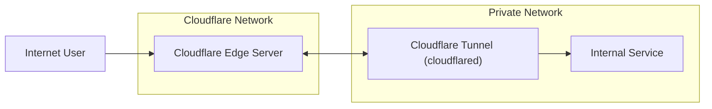

# cloudflare zeroTrust 访问控制的正确使用姿势

## 前言

家庭小服务器上跑的一些服务想要在公网访问，在目前运营商收紧公网IP，不让用80和443端口的情况下，变得越发困难和别扭;如果想上域名走https，还需要配置`DDNS`解析。
然而只要有一个域名就可以享受cloudflare大善人免费提供的zerotrust服务把内网应用映射到公网上，并且还能躲在cloudflare的cdn、防护和访问控制后面。

近期在捣鼓一些玩意的时候，在配置访问控制的时候踩了些坑，官网文档在这一块写的有点简略，故在此做一下记录。

## zerotrust

下图是整体的网络情况，通过内网运行的`cloudflared`，该服务会创建一个隧道，就可以把内网的服务暴露到公网上。

其中防护、认证相关的事情就是发生在  `Cloudflare Edge Server` 上，如果你针对这个域名或者路径，配置了访问控制的话，
浏览器访问的话优先会弹到对应租户的`cloudflareaccess.com`的登录页。

cloudflare可以配置常见的认证平台比如说`github`、`Auzre AD`（微软账号），当让如果你希望更加方便的访问，可以考虑使用我的一个worker项目（
[blog](https://hynemankan.top/posts/2025/use-keypass-login-cloudflare-zerotrust.html) ｜
[GitHub](https://github.com/HynemanKan/passkey-openid-cloudflare-worker/)）
实现了keypass到oidc的转换，可以使用iphone的faceId、windows的windows hello这些系统级身份服务进一步实现快捷登录。

在得到你的身份（email）后，你在访问控制里面配置的规则完成决定你是否被放行。
这一部分的配置cloudflare的文档写的十分详细，我就不过多的介绍了，可以去看官方文档 [docs](https://developers.cloudflare.com/cloudflare-one/access-controls/policies/)。

## 高级用法

### 浏览器呈现

不仅可以配置web应用，你还可以吧`RDP`、`SSH`和`VNC`的`应用程序路由`在浏览器中给你一个窗口（终端）来操作，详见[官网文档](https://developers.cloudflare.com/cloudflare-one/tutorials/vnc-client-in-browser/)

<BrowserIframe src="https://developers.cloudflare.com/cloudflare-one/tutorials/vnc-client-in-browser/" title="docs"/>

生效的的条件是：

- 配置`应用程序路由`时选择对应的远程连接协议。
- 配置应用的时候勾选浏览器呈现相关功能。

### SERVICE AUTH

上面描述了浏览器访问的情况，那么肯定不像仅局限于浏览器访问，有时候我们希望通过api的方式去调用，但又不像吧api自己暴露在公网上。

针对这个情况官方提供了一套解决方案，就是`SERVICE AUTH`,要配置一个`SERVICE AUTH`需要配置好几个地方，这一块[官方文档](https://developers.cloudflare.com/cloudflare-one/access-controls/service-credentials/service-tokens/)就写的比较简略。

<BrowserIframe src="https://developers.cloudflare.com/cloudflare-one/access-controls/service-credentials/service-tokens/" title="docs"/>

`SERVICE AUTH`要生效的的条件是：

- 设备注册权限里面配置了`SERVICE AUTH`类型`include`对应`Service Token`的策略 （入口位于 团队与资源》设备》管理》设备注册权限） 
- 在访问控制中创建一个应用并配置`SERVICE AUTH`类型`include`对应`Service Token`的策略

:::tip IMPORTANT
如果你的应用既要浏览器访问又要api访问，请分别创建两个应用，请不要在浏览器访问的策略中添加`SERVICE AUTH`策略，这会导致`SERVICE AUTH`不生效。
:::

### BYPASS

:::danger DANGER
添加`BYPASS`策略将允许任何人的访问相应的资源，请在却有必要的时候配置。
:::

如果你的一个服务中的部分路径要完全公开给其他应用掉调用，但其他路径还是需要在防护后面，那么这个时候就需要BBYPASS这个配置了。
这一块[官方文档](https://developers.cloudflare.com/cloudflare-one/access-controls/policies/#bypass)的描述也比较简略，侧重于劝你不要用这个规则。

<BrowserIframe src="https://developers.cloudflare.com/cloudflare-one/access-controls/policies/#bypass" title="docs"/>

`BYPASS`要生效的的条件是：

- 在访问控制中创建一个应用并配置`BYPASS`类型包含`everyone`或`IP range`的策略

> 如果是为了让某些固定IP访问的话， `allow`就行没必要使用BYPASS规则。

