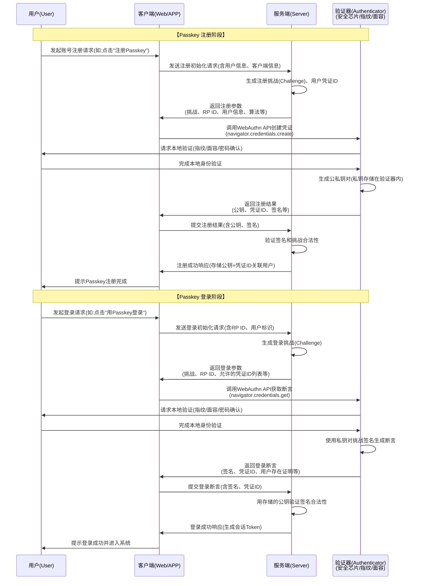
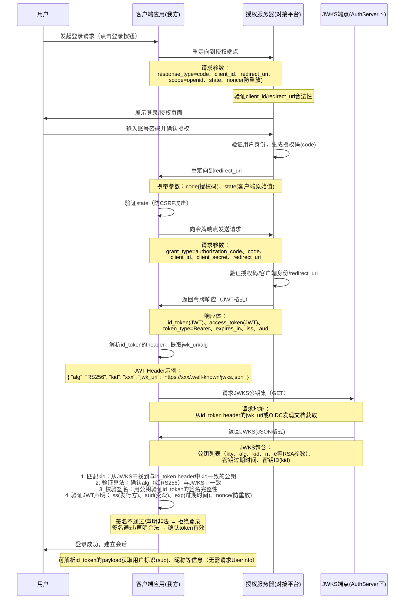

# 用 passKey 快速登录你的 cloudflare zeroTrust 应用

## 前言

cloudflare这个大善人的 `zero trust` 服务有免费计划，对于个人来说他限制的50个席位那是绰绰有余，
配合`cloudflared`构建的隧道和`access Control`遍可以安全的在公网访问家中机器上跑的应用（web应用的静态资源甚至能吃到cdn），
但是默认配置的认证是`oneTime pin`就是每次给你发验证码，虽然也可以绑定`github`、`Azure AD`(微软账号)这些三方认证服务，
但对于我们这种web开发者，浏览器全清那是日常调试和debug中长有的操作，那么用这些认证服务势必要重新输入一遍密码。

那么有没有啥优雅而又安全的方法呢，首先想到的就是`passkey`,在win下`windows hello`、mac下的`faceID`和`touchID`跟别提`yubikey`、`1password`这些和系统类型无关的设备和服务了，都通过各种模式对passkey做了适配。

但是我们可以看到cloudflare官方支撑的认证中心中不包含`passkey`这也没什么问题，毕竟`passkey`只是一种认证手段。


那么秉持着白嫖到底的思路，就有了这片文章的实践，用`worker`配合`D1`数据库，实现了一个最小化的支持（也仅支持）passkey登录的OIDC服务。

## 先看效果

<iframe style="width:100%;height:600px" src="//player.bilibili.com/player.html?isOutside=true&aid=115757555909080&bvid=BV1p4qSBBESi&cid=34887699866&p=1" scrolling="no" border="0" frameborder="no" framespacing="0" allowfullscreen="true"></iframe>

仓库地址  [GitHub](https://github.com/HynemanKan/passkey-openid-cloudflare-worker/)

## 核心协议

让我们先看看两个涉及到的协议

### passkey/webauthn

这一类操作就是挑战本质上就是一个签名挑战的过程。

整体的注册流程和认证流程如下，在浏览器环境具体实现使用的是webauthnAPI；秉承着有轮子就不造新的原则使用现成的npm库`@passwordless-id/webauthn` 实现。


### OIDC（openID connect）

这一块以csdn为首的国内社区会告诉你这个和OAuth2.0是一样的，是基于OAuth2.0实现的，确实整体的流程是大差不差的，但是让我看看cloudflare后台配置页需要哪些参数。


其中这四个`应用 ID` `客户端密码` `身份验证 URL` `令牌 URL` 都和 OAuth2.0 要的一模一样；但最后一个是`证书URL`不是我们常见的用户信息查询接口。

`OIDC` 在调用认证的时候所构造的前台跳转参数`scope`所给的值中会包含`openid`

根据`OIDC`规范，携带这个参数的时候在`令牌 URL`的返回体中包含一个非对称加密算法签发的openID（jwt token），payload中需要包含scope中其他请求的信息。


应用会去`证书URL`的地址获取`jwks`即公钥，通过公钥验证jwt的签名是否正确，并从payload中获取用户身份。

整体流程如下


## 整体实现

那么在~~踩坑~~了解完所有协议后，实现就很简单了。（后续内容可能AI味道会比较重，毕竟我已经工作模式初步融入了部分Vibe Coding，写文档这中事情当然就让AI代劳了）

### 前端技术栈
- **Vue 3** - 采用 Composition API 和 `<script setup>` 语法
- **TypeScript** - 提供完整的类型安全
- **Naive UI** - 现代化组件库，支持主题定制
- **Vue Router** - 单页面应用路由管理
- **Vite** - 快速的构建工具和开发服务器

### 后端技术栈
- **Cloudflare Workers** - 无服务器边缘计算平台
- **D1 Database** - Cloudflare 原生 SQLite 数据库
- **Drizzle ORM** - 类型安全的数据库操作库
- **@tsndr/cloudflare-worker-router** - 轻量级 HTTP 路由器
- **@tsndr/cloudflare-worker-jwt** - JWT Token 处理库

### webauthn方案
- **@passwordless-id/webauthn** - WebAuthn API 封装库

## 具体实现

请看 [GitHub](https://github.com/HynemanKan/passkey-openid-cloudflare-worker/)

## 使用方案

- 请按照项目中`readme.md`文档完成部署。
- 由于~~安全~~偷懒对原因，没有做管理面板，需要创建绑定连接的话，请使用cloudflare d1 的管理面板手动在`binding`表中添加数据并构造如下url访问。

```txt
https://${your-domain}/binding?ticket=${challenge_id}
```
